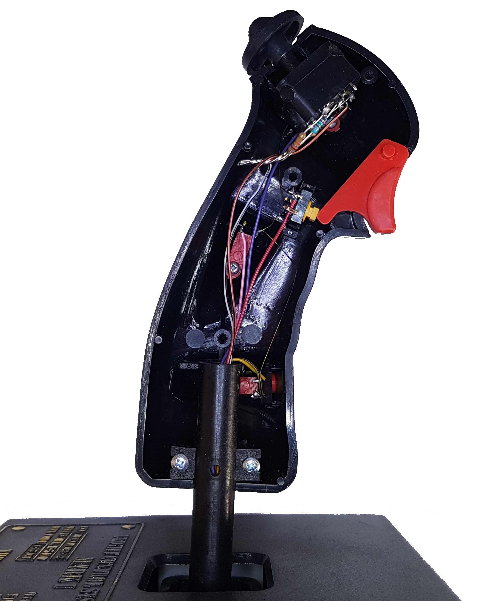
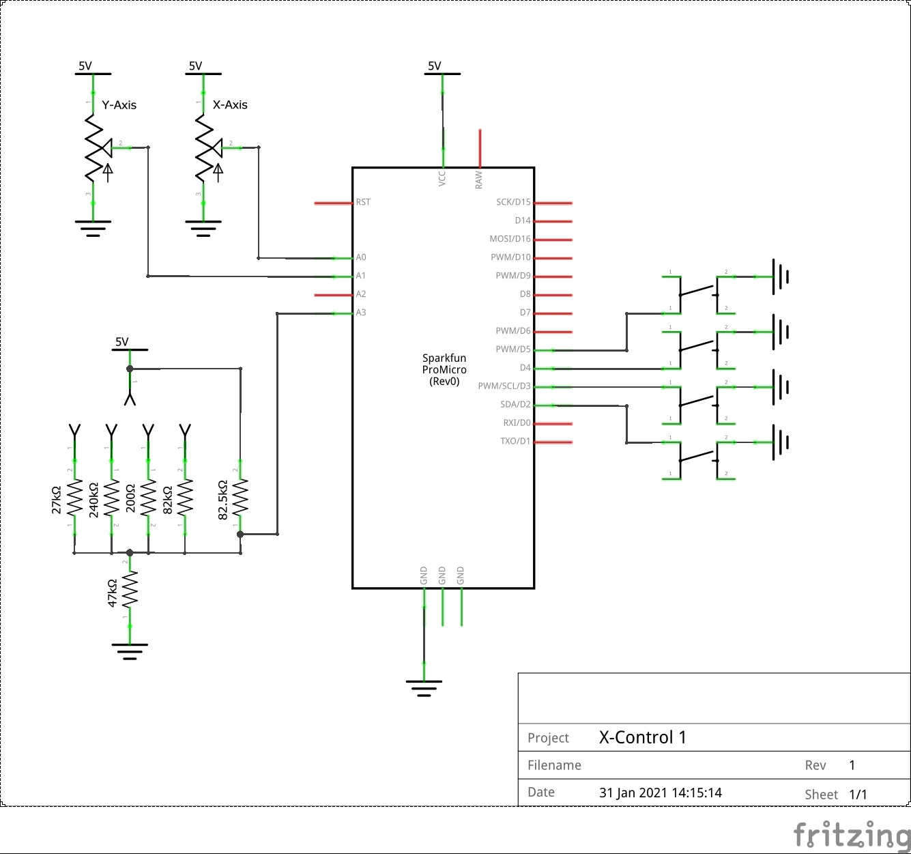
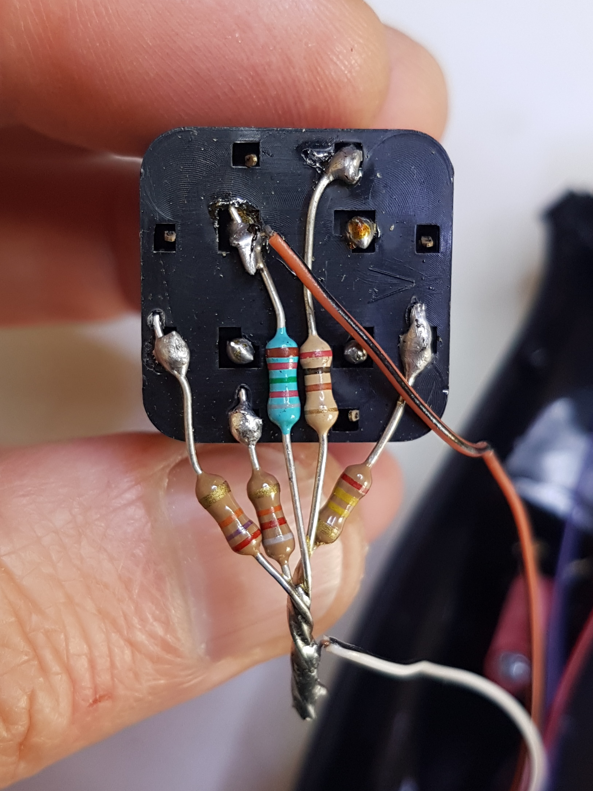

# x-control
Open Source USB-HID custom control interfaces

## X-Control-1
The x-control-1 is a primary controller interface based on the design of the Thrustmaster FCS Mark I.
The FCS features 2 analog axes, 4 digital buttons, and a 6-position POV hat switch (analog). The original design featured a 15-pin DSUB gameport interface.
X-Control-1 retains all functionality of the original design, exposed as a modern USB HID device.

### Schematic

### Hardware Implementation
The design approach is to try to ensure any modifications made to the original hardware are non-destructive.
#### Axes
One necessary adjustment is to the way the linear pots are wired to the vertical and horizontal axis. In the original design, VCC is connected to the wiper, and the analog signal line is connected to one side of the pot. The other side of the pot is left unconnected. 
The value of the pot was read using a monostable multivibrator circuit, which measured the length of time to charge and discharge a capacitor. The bigger the potentiometer resistance value is, the longer it takes for the capacitor to reach a certain threshold voltage, which in turn can be used to derive the position of the stick (since the potentiometer is directly adjusted by the angle of the stick). This simple method for measuring the resistance value is cheap, but not very accurate.
(read more at https://www.epanorama.net/documents/joystick/pc_joystick.html)

In modern circuits, it is more common to wire either end of the pot to GND and VCC, and to connect the middle wiper output to a DAC to read the resistance value, and this is the approach taken here.

#### Hat
The original wiring of the hat switch may seem fairly complicated. Indeed, it was the subject of a [U.S. Patent 5389950](https://uspto.report/patent/grant/5389950). Each directional switch in the hat corresponds to a different resistor value. These are wired in parallel with a resistor connected to the centre switch, meaning that a number of discrete digital inputs can be multiplexed together into a single analog value. By reading that value via an ADC and applying appropriate logic in code, we can work out what combination of resistors must have been connected.

| Hat Position | Resistor |
| Left | 240kΩ |
| Up | 200Ω |
| Centre | 82.5kΩ |
| Down| 82kΩ |
| Right| 27kΩ |
| Down-Left| 82kΩ + 240kΩ |
| Down-Right| 82kΩ + 27kΩ |

### Software

